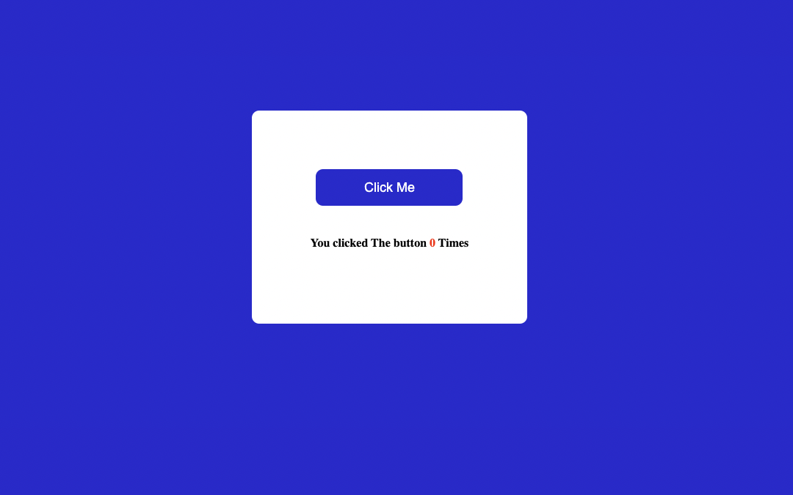

## Hi, I'm Sudhansu Sekhar Mahankuda ! 👋

### 🚀 I'm a front-end developer...

# Click The Button

- In this app each time we click the button the count will increase and update simultaneously.

---

- It took me around  30 mins to make this project .

## 🛠 Skills
HTML, CSS, JavaScript

[LinkedIn](https://www.linkedin.com/in/sud-sekhar/)

[Netlify](https://click-the-button-sud.netlify.app/)

